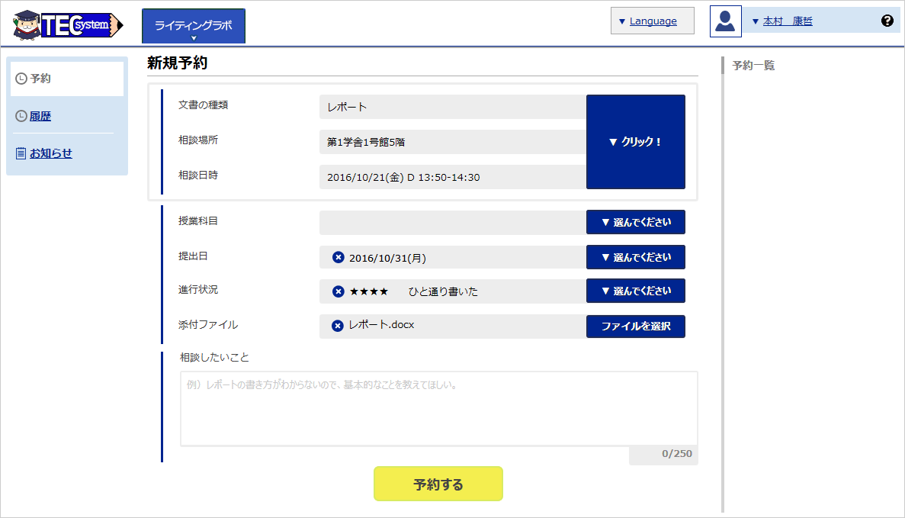
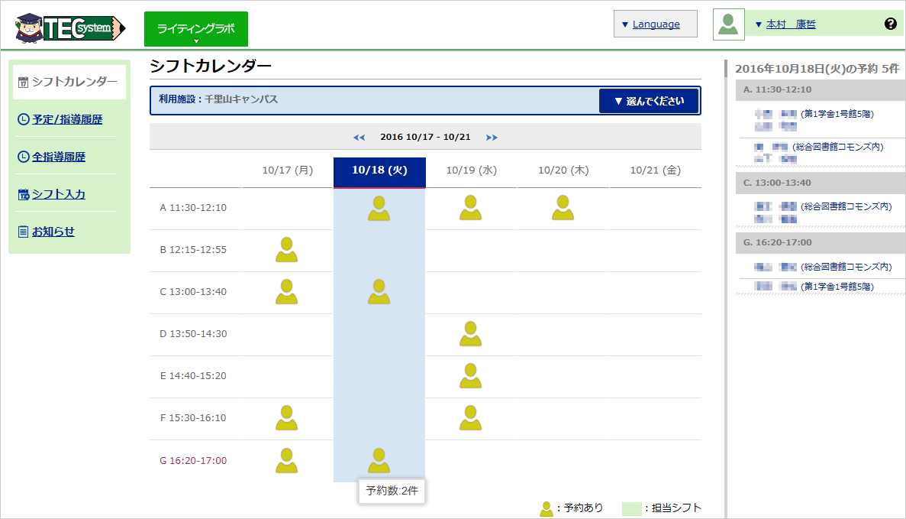
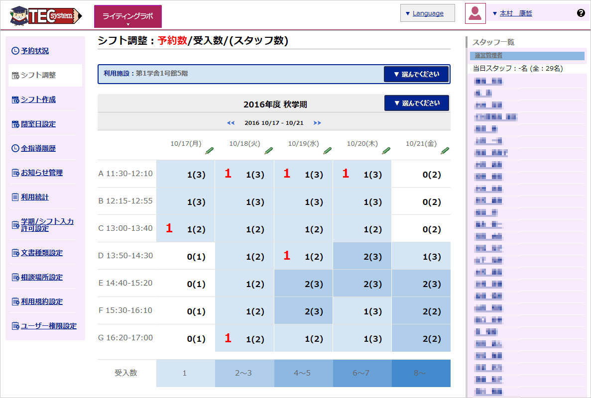
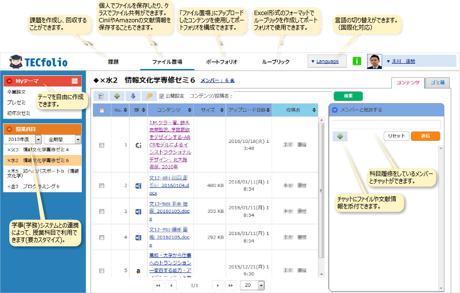

# TEC-system  = Booking + Portfolio

 

## Overview
---

　"TEC-system"はウェブベースの対面相談支援システムです。ライティングセンター、学習支援センター等のアカデミックサービスの運用を支援します。TEC-systemは**TEC-book**と**TEC-folio**の2つのサブシステムからなります。これらのサブシステムはそれぞれ個別に運用することが可能です。  
- **TEC-book** ：　対面相談予約システム
  - ライティングセンター等の相談者の予約、履歴、対応者のスケジューリングを行います。

- **TEC-folio** ：　eポートフォリオシステム
  - レポート等の学習成果物の集積、ルーブリックによる評価、メンターとのコミュニケーションなどの機能を有します。  

 

※"TEC-system"は、2012年に関西大学と津田塾大学が採択された文部科学省・大学間連携共同教育推進事業 **「〈考え、表現し、発信する力〉を培うライティング／キャリア支援」** における成果の一つです。

 

## Demo
---

 

### 1. TEC-book
#### 学生

 

#### チューター

 

#### 管理者

 

#### TEC-book利用の流れ

 

### 2. TEC-folio

 

## Requirement
---
### ソフトウェア
* Linux：Red Hat Enterprise Linux 7.2
* Apache 2.4
* PHP 5.4.45,
* PostgreSQL 8
* Smarty 3.1.13

 

## Install
---

[INSTALL.md](INSTALL.md)をお読みください。

 

## License
---

[BSD](LICENSE.txt)

 

## Author
---

[Kansai University](http://www.kansai-u.ac.jp/)
